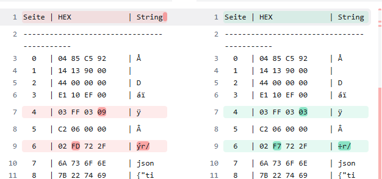
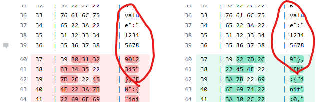
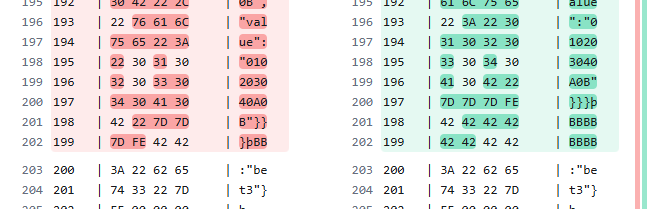
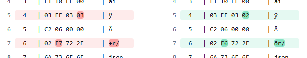
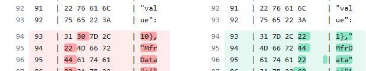
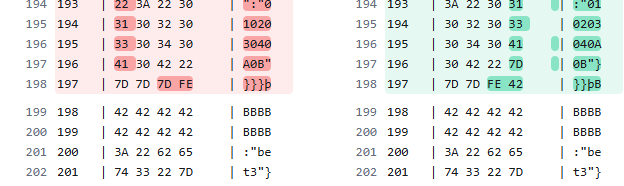

# NFC Tag Configuration Tool for BLE Beacons

A Python-based toolkit for reading, writing, and managing BLE beacon configurations stored on NFC tags (NTAG213/215/216). Built for batch-configuring Bluetooth beacons via an ACR122U NFC reader.

---

## Features

- **Read** NFC tags and extract embedded JSON beacon configurations
- **Write** modified configurations back to tags with automatic sequential naming (e.g. `SF-7770001`, `SF-7770002`, ...)
- **Batch mode** for programming multiple tags in sequence
- **Debug reader** with full hex/ASCII memory dump and JSON extraction
- **Name list extraction** from multiple tags for inventory tracking
- **Reader control** (power management, buzzer on/off)

---

## Hardware Requirements

- NFC card reader (ACR122U or compatible)
- NFC tags (NTAG213 / NTAG215 / NTAG216)

---

## Installation

```bash
# Python 3.7+
pip install pyscard
```

Optional dependencies for advanced functionality:

```bash
pip install nfcpy ndeflib pyserial libusb1
```

---

## Usage

### 1. Read a Tag

```bash
python reader.py
```

- Select single or continuous reading mode
- A `.txt` file is generated with the tag's data as an editable Python dictionary (named by tag UID)

### 2. Write Tags

```bash
python writer.py
```

- Paste the `NEUE_DATEN` dictionary from the reader output into `writer.py`
- Optionally enable dynamic naming for sequential beacon IDs
- Present tags one by one — the writer programs each tag and increments the counter

### 3. Debug / Inspect

```bash
python debug_reader.py
```

- Displays all NFC tag memory pages in hex and ASCII
- Extracts and saves the embedded JSON configuration to `config.json`

### 4. Extract Beacon Names

```bash
python namelist.py
```

- Reads beacon names from multiple tags
- Saves a timestamped list to `nfc_namen_liste_*.txt`

### 5. Reader Control

```bash
python tonausmachen.py
```

- Toggle reader buzzer and power state

---

## Beacon Configuration

The tags store a JSON configuration with the following BLE beacon properties:

| Property   | Description                        | Example Value      |
|------------|------------------------------------|--------------------|
| `Name`     | Beacon identifier (max 15 chars)   | `SF-7770001`       |
| `Power`    | TX power level (dBm)               | `4` (-40 to 4)     |
| `Format`   | Broadcast format                   | `Eddystone`        |
| `AdvRec`   | Advertisement interval (seconds)   | `10.0` (0.1 - 10)  |
| `UUID`     | iBeacon UUID                       | `01020304...0F10`  |
| `Major`    | iBeacon Major                      | `020B`             |
| `Minor`    | iBeacon Minor                      | `010A`             |
| `NID`      | Eddystone Namespace ID             | `01020304...090A`  |
| `BID`      | Eddystone Beacon ID                | `010203040A0B`     |

---

## NFC Memory Layout

| Pages    | Content                              |
|----------|--------------------------------------|
| 0 – 2    | Manufacturer data (read-only)        |
| 3 – 7    | NDEF message header                  |
| 8 – 201  | JSON configuration (UTF-8 encoded)   |
| 202+     | Footer / additional data             |

End marker: `0xFE` byte after JSON payload.

---

## Project Structure

```
reader.py           # Read tags and generate editable config files
writer.py           # Write configurations to tags (batch mode)
debug_reader.py     # Full memory dump and JSON extraction
namelist.py         # Extract beacon names from multiple tags
tonausmachen.py     # NFC reader power/buzzer control
config.json         # Example beacon configuration template
```

---

## Tech Stack

- **pyscard** – Smartcard/NFC reader communication via APDU commands
- **nfcpy** / **ndeflib** – NFC Data Exchange Format handling
- Python 3.7+

---

## Memory Behavior When Changing the Beacon Name *(Work in Progress)*

This section documents observed changes in NFC tag memory when the beacon name length is modified.

### Effect on Beacon Name Length

The following comparison shows the raw memory contents before and after shortening the beacon name from 15 characters to 9 characters:

| Before (15 chars)                                         | After (9 chars)                                            |
| --------------------------------------------------------- | ---------------------------------------------------------- |
|  |     |

The HEX length values decreased by 6, reflecting the 6-character reduction in the name.



### Memory Block Shift

Due to the 6-character shorter name, the memory block shifted by 2 pages:



The previously reserved dummy/padding memory blocks absorbed the shift — the payload is offset by 6 bytes:



### Effect on Configuration Values

| Before                                           | After                                            |
| ------------------------------------------------ | ------------------------------------------------ |
|  |   |

Two HEX values each increased by 1:



The updated configuration value caused a global shift in the memory layout:



The dummy/padding memory blocks were also reduced by one entry:



---

## License

MIT
